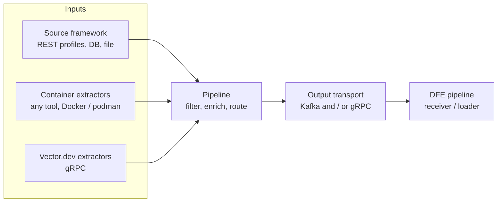

# dfe-fetcher

[](LICENSE)

Data fetcher for the HyperI DFE (Data Fusion Engine) platform. It pulls
security and operational data from cloud and SaaS providers, databases, files
and external extractors, then delivers each record to the DFE pipeline over
Kafka and/or gRPC. It is built on the
[scalo](https://github.com/hyperi-io/scalo-rs) data-plane runtime (config
cascade, logging, metrics, transport, memory guard, deployment contract).

## Architecture

Three input families feed one pipeline. They are independent siblings, not a
chain: any combination can run at once.



- **Source framework** -- every provider is a declarative REST profile (a YAML
  file describing the shape of an API) run by one generic driver; databases
  and files run through the same driver as their own shapes. There is no
  per-provider Rust.
- **Container extractors** -- run any tool in a Docker or podman container and
  collect its stdout JSON lines, or accept HTTP POSTs on the ingest endpoint.
- **Vector.dev extractors** -- receive data over Vector's native gRPC protocol.

[docs/DESIGN.md](docs/DESIGN.md) has the diagrams (system, the framework's
tick, the configuration cascade) and the design rationale;
[docs/architecture.md](docs/architecture.md) is the codemap of the Cargo
workspace. The
reference pages are
[docs/reference/profile-grammar.md](docs/reference/profile-grammar.md) (every
field and closed vocabulary of a profile) and
[docs/reference/snapshot-envelope.md](docs/reference/snapshot-envelope.md)
(the frames a dump travels in).

## Features

- **Declarative REST sources** -- a profile names the base URL template, the
  auth modes the API accepts, the endpoints with their decoder and pager, and
  the request constructs (a keyset, a two-stage lookup, a manifest, a queue).
  An instance binds it to one deployment's identity. Unknown keys, decoders,
  pagers and auth modes fail the load with the YAML line.
- **Database sources** -- a `dump` store selects a whole result set into the
  snapshot envelope; a `tail` store follows a table by key tuple. ODBC (every
  SQL dialect with a driver), the ClickHouse HTTP interface, and MongoDB
  (collections dumped, tailed by change stream); the driver and licence
  per engine are in [docs/reference/db-drivers.md](docs/reference/db-drivers.md).
- **File sources** -- a `dump` unit reads each file a glob matches once
  (NDJSON, JSON array, CSV, gzip by magic), one snapshot per file; a `tail`
  unit follows growing files through rotation.
- **Checkpoint after acknowledgement** -- a unit's cursor or checkpoint is
  written only after the transport has taken the batch, so a failed tick
  re-fetches and a queue message is acknowledged only after delivery.
- **Snapshot envelope** -- a dump travels as `begin`, rows and `end` frames
  under one `snapshot_id`, so a consumer can rebuild a whole store and tell a
  truncated dump from a complete one.
- **Filtering and enrichment** -- a per-source CEL filter (hot-reloaded), then
  the fetch and receive timestamps and the source tags.
- **Memory-pressure brake** -- rows are pulled from the provider only while
  the memory guard admits them; a paused source flushes what it holds.
- **Credential resolution** -- every secret field is a spec: a secrets-manager
  reference, an environment variable, or a literal.
- **Observability** -- Prometheus metrics and liveness / readiness probes.
- **Live config reload** -- via SIGHUP or file watch.
- **Deployment artefacts** -- generates its own Dockerfile, Helm chart and
  Compose file from a deployment contract.

## Quick Start

```bash
# Build (the default features carry the REST sources; see Development for the
# database and file features)
cargo build --release

# Validate a config without running
./target/release/dfe-fetcher config-check --config config.example.yaml

# Run
./target/release/dfe-fetcher --config config.example.yaml
```

Container and Helm artefacts are generated from the deployment contract:

```bash
dfe-fetcher emit-dockerfile > Dockerfile
dfe-fetcher emit-chart ./chart
dfe-fetcher emit-compose > docker-compose.yaml
```

## Configuration

[config.example.yaml](config.example.yaml) is the annotated reference for
every setting, [docs/config-schema.yaml](docs/config-schema.yaml) is the
generated JSON Schema of the whole surface (the profile grammar included), and
[docs/reference/profile-grammar.md](docs/reference/profile-grammar.md) is the
profile grammar field by field.
Configuration loads through a layered cascade (CLI, then `DFE_FETCHER_*`
environment variables, then config files, then defaults); send `SIGHUP` to
reload the hot-reloadable settings without a restart. The cascade is
diagrammed in [docs/DESIGN.md](docs/DESIGN.md).

Service ports: metrics and health on `9090` (`/livez`, `/readyz`), and -- each
off until a deployment turns it on -- the ingest HTTP endpoint on `8080` and
the Vector gRPC receiver on `6000`.

### Source blocks

Every provider keeps its typed block (`sources.aws`, `sources.okta`, ...),
which maps onto an instance of the shipped profile of the same name at load.
Three generic blocks sit beside them:

- `sources.rest.<id>` -- an instance of a shipped profile by name, or of a
  profile written inline. A second instance of a provider (two runZero
  consoles, two S3 accounts) or an API with no typed block goes here.
- `sources.db.<id>` -- an engine, its connection string as a secret spec, and
  the stores to dump or tail.
- `sources.file.<id>` -- the units to dump by glob or to tail.

The map key of each is the connection id: the cursor key, the metric and log
label, and the `_source_fetcher` prefix on every record.

### Idle until configured

A fetcher with no enabled source, no container extractor and the ingest
listener off has nothing that can produce a record. It starts, passes
readiness, serves health and metrics, and opens no transport -- the
`pipeline_idle` gauge sits at 1 and the `work_config` health component reports
Degraded, so an operator can see it has nothing to do while the deploy's
readiness gate still passes. Writing the first source into its config takes it
out of idle without a restart.

A missing broker or endpoint is refused only once something would send to it,
so an empty config is not a startup failure.

### Credential resolution

Credential fields accept these forms:

- `vault:<mount>/data/<path>:<key>` -- resolve from the secrets manager
  (OpenBao / Vault). The KV v2 mount is followed by a literal `data` segment;
  without it the whole path is read under the default `secret` mount.
  `bao:` and `openbao:` are the same lookup under the names the OpenBao
  tooling uses.
- `env:VARIABLE_NAME` -- read from an environment variable
- `file:<path>` -- read a local file, typically a mounted Kubernetes Secret
- a literal value -- used as-is

`aws:` is in the resolver's vocabulary but needs a secrets feature the fetcher
does not build, so it is refused at load rather than reaching a provider as
literal text; AWS keys come in as `sigv4` identity fields instead.

A source's identity fields accept the same forms: the identifiers a
provider is addressed by (tenant, subscription, project, account, organisation,
user, client id, tenant URL, API host), at block level and on every connection.
The pass in `crates/fetcher/src/config/resolve.rs` is the list. They resolve
once at startup, before any source is built, so an unresolvable spec stops the
process with a configuration error instead of reaching the provider as literal
text. A block that is not enabled is skipped.

Any key can also be set from the environment as
`DFE_FETCHER_SOURCES__<BLOCK>__<FIELD>` (a single leading separator is
accepted too), which the cascade applies before resolution. The order is the
file, then an `env:` or `vault:` spec written in the file, then the environment
variable, which replaces whatever the file says and is itself resolved if it is
a spec.

## Sources

Each source is a shipped profile under `crates/fetcher/profiles/`. Its
maturity is the `maturity` field of the profile, which the capability catalog
([docs/capability-catalog.yaml](docs/capability-catalog.yaml)) repeats; the
fetcher logs a warning at startup for any enabled source that is not stable.
The setup guides are indexed in
[docs/cloud-setup/README.md](docs/cloud-setup/README.md).

| Source | Block | What it pulls | Maturity | Guide |
|--------|-------|---------------|----------|-------|
| AWS | `sources.aws` | CloudTrail, GuardDuty, Security Hub, Config, CloudWatch Logs and Metrics, Inspector v2, Health | stable | [aws.md](docs/cloud-setup/aws.md) |
| Azure | `sources.azure` | Activity Log, Defender alerts, Sentinel incidents, the Entra ID audit feeds, Log Analytics queries | stable | [azure.md](docs/cloud-setup/azure.md) |
| Microsoft 365 | `sources.m365` | Management Activity feeds (audit, DLP, Exchange), Graph security alerts | stable | [m365.md](docs/cloud-setup/m365.md) |
| Google Cloud | `sources.gcp` | Cloud Audit Logs, VPC flow and DNS query logs, any Cloud Logging filter, Security Command Center findings | stable | [gcp.md](docs/cloud-setup/gcp.md) |
| Google Cloud Pub/Sub | `sources.gcp_pubsub` | Pull subscriptions (a Cloud Logging sink), acknowledged after delivery | alpha | [gcp_pubsub.md](docs/cloud-setup/gcp_pubsub.md) |
| Google Workspace | `sources.google_workspace` | Reports API activity per application | alpha | [google_workspace.md](docs/cloud-setup/google_workspace.md) |
| Okta | `sources.okta` | System Log | alpha | [okta.md](docs/cloud-setup/okta.md) |
| Cisco Duo | `sources.duo` | Admin API authentication logs | alpha | [duo.md](docs/cloud-setup/duo.md) |
| CrowdStrike | `sources.crowdstrike` | Falcon alerts | alpha | [crowdstrike.md](docs/cloud-setup/crowdstrike.md) |
| Cloudflare | `sources.cloudflare` | Account audit logs | alpha | [cloudflare.md](docs/cloud-setup/cloudflare.md) |
| Datadog | `sources.rest` (profile `datadog`) | Audit trail events, security signals | alpha | [datadog.md](docs/cloud-setup/datadog.md) |
| Bitwarden | `sources.bitwarden` | Organisation event logs | alpha | [bitwarden.md](docs/cloud-setup/bitwarden.md) |
| 1Password | `sources.onepassword` | Sign-in attempts, item usages, audit events | alpha | [onepassword.md](docs/cloud-setup/onepassword.md) |
| Slack | `sources.slack` | Enterprise Grid audit logs | alpha | [slack.md](docs/cloud-setup/slack.md) |
| GitHub | `sources.github` | Organisation or enterprise audit log | alpha | [github.md](docs/cloud-setup/github.md) |
| Salesforce | `sources.salesforce` | Setup audit trail, login history, event log files | alpha | [salesforce.md](docs/cloud-setup/salesforce.md) |
| Object store | `sources.object_store` | S3 (and S3-compatible) bucket prefixes, each object read once | alpha | [object_store.md](docs/cloud-setup/object_store.md) |
| PyPI, crates.io, Go modules | `sources.pypi`, `sources.crates_io`, `sources.go_modules` | Package metadata for supply-chain monitoring | alpha | [supply-chain.md](docs/cloud-setup/supply-chain.md) |
| runZero | `sources.rest` (profile `runzero`) | Asset inventory exports as snapshot dumps | alpha | [runzero.md](docs/cloud-setup/runzero.md) |
| Databases | `sources.db` | Any ODBC-reachable database, ClickHouse or MongoDB: stores dumped whole or tailed by key | alpha | [db-drivers.md](docs/reference/db-drivers.md) |
| Files | `sources.file` | Directories of NDJSON / JSON / CSV dumps, or log files tailed | alpha | [config.example.yaml](config.example.yaml) |

## Adding a source

Write a profile first: a YAML file under `crates/fetcher/profiles/` that
names the base URL template, the accepted auth modes, the window format, the
retry policy and each endpoint's path, decoder, pager and construct, then
register it in `crates/fetcher/src/profiles/mod.rs`. A one-off API needs no
shipped profile at all: write the same grammar inline under
`sources.rest.<id>.profile`. Rust is added only for what the closed grammar
cannot express -- a signing scheme, a listing protocol, a row shape no decoder
frames, a paging quirk -- and lands as a variant on the matching axis in
`crates/rest` (an auth mode, a lister, a row builder, a pager), never as a
per-provider module. The grammar as built is
`crates/rest/src/profile/mod.rs`; the vocabulary is tabled in
[docs/reference/profile-grammar.md](docs/reference/profile-grammar.md).

## Development

```bash
cargo fmt --all -- --check
cargo clippy --workspace --all-targets --all-features -- -D warnings
cargo nextest run --workspace --all-features
```

`--all-features` builds the ODBC engine, which needs unixODBC on the host
(`libodbc` and its headers). Without it, drop the feature or build the
database engines you have: the app's features are `db-odbc`, `db-clickhouse`,
`db-mongodb`, `file`, `file-tail`, `jemalloc` and `full`. Live,
credential-gated provider tests are `#[ignore]` by default; each setup guide
says how to run its own.

## License

BUSL-1.1 -- see [LICENSE](LICENSE) for details.

Copyright (c) 2026 HYPERI PTY LIMITED

## Context

### What this is

A Rust service that PULLS. It polls external providers -- cloud and SaaS APIs
over REST, databases, files -- and hands each record to the DFE pipeline over
Kafka or gRPC. Every provider is a declarative YAML profile run by one generic
driver, so a new source is data, not Rust.

It is not a default component. `dfe-infra/apps.yaml` gives it `default_in: []`,
so no deploy profile stands one up; `multiplicity: per_config` means the engine
writes one fetcher deployment per configured source, keyed by
`config.instance_id`, when that source is written. `scale_deployed: false` --
KEDA does not drive it. Compare dfe-receiver in the same manifest, which is
`single` and `scale_deployed: true`.

Every provider connection is outbound: this service dials, nothing dials in.
Both inbound listeners ship off -- the ingest HTTP endpoint on 8080
(`IngestConfig::default().enabled` is false) and the Vector gRPC receiver on
6000 (`VectorExtractorConfig::default().enabled` likewise), both in
`crates/fetcher/src/config/mod.rs`. Only metrics and health on 9090 listen by
default. So grade a dependency advisory here by reachability first and severity
second: the same advisory in dfe-receiver, which takes untrusted input, is a
different finding. `dfe-infra/docs/THREAT-MODEL.md` is the source of truth for
that, and an entry in its accepted-risks table is settled. The one way to hand
this service untrusted input is enabling ingest without an `auth_token`:
`/ingest/{source}/{topic}` takes the destination topic from the URL, so an open
listener lets anything that can reach the port write to any topic.

### Where things live

| Path | What it holds |
|---|---|
| `crates/core` | The I/O-free framework: row model, batcher, compiled per-row rules, snapshot envelope, checkpoint contract. Names no HTTP client, no transport, no file. |
| `crates/rest` | The REST profile grammar and its runtime axes -- auth modes, pagers, decoders, the request executor, the hooks. |
| `crates/db`, `crates/file` | The database and file shapes. The engines and the tailer are feature-gated; the grammars are always linked. |
| `crates/fetcher` | The binary: config cascade and hot reload, scheduler, the per-tick `Driver`, pipeline, output transports, cursor store, ingest server, Vector and container extractors. |
| `crates/fetcher/profiles/*.yaml` | The 21 shipped REST profiles. A new one is registered in `crates/fetcher/src/profiles/mod.rs`. |
| `crates/fetcher/src/deployment.rs` | The deployment contract, and the drift tests that hold the generated artefacts to it. |
| `Dockerfile`, `chart/`, `docs/config-schema.*`, `docs/capability-catalog.*` | Generated from that contract and committed. Never hand-edited -- see below. |
| `third-party/vector-file-source{,-common}` | Vector's file tailer (MIT), vendored, depended on by path from `crates/file` only. |
| `scripts/generics_gates.py` | The generics acceptance gates: one framework site per provider mechanism, the crate dependency direction, per-hook line budgets. |
| `config.example.yaml` | The annotated reference for every setting. |
| `docs/architecture.md`, `docs/DESIGN.md` | The workspace codemap with its negative invariants, and the diagrams plus rationale. |

### Commands that prove a change

```bash
make check    # the generics gates, then hyperi-ci check
make gates    # the gates alone -- deterministic, needs only python3 and ripgrep
```

Three ways a green run says more than it proved:

- **CI never runs `--all-features`.** `.hyperi-ci.yaml` lists three feature
  sets: `default`, `jemalloc`, and `db-clickhouse,db-mongodb,file-tail`.
  `db-odbc` is out on purpose -- it links unixODBC and needs driver packages on
  the runner, which that config cannot declare -- so CI compiles and lints
  neither the ODBC engine nor its tests. The `cargo nextest run --workspace
  --all-features` in Development does build it, and needs `libodbc` and its
  headers on your host.
- **Live provider tests are `#[ignore]`.** A green run has not talked to AWS,
  Okta or any other provider. Each `docs/cloud-setup/*.md` says how to run its
  own.
- **`hyperi-ci check` on its own skips the generics gates.** `make check` runs
  them first, which is why it is the target to use.

### What tends to bite

| Don't | Do | Why |
|---|---|---|
| Hand-edit `Dockerfile`, `chart/` or the generated files under `docs/` | Change `crates/fetcher/src/deployment.rs` and regenerate | A deploy installs the committed chart, never a freshly generated one, so a template missing from the commit is absent from every deployment. In #71 the KEDA ScaledObject referenced a TriggerAuthentication nothing created and the fetcher never scaled on lag. `checked_in_chart_matches_generated` and `checked_in_dockerfile_matches_generated` now compare file for file and name the regenerate command in the failure. |
| Bump scalo and stop there | Regenerate the artefacts in the same change | scalo owns the generators -- the Dockerfile banner names `scalo::deployment::generate_dockerfile()` and the schema version it emitted. A release that moves a generator fails those two drift tests until the files are regenerated. That is the guard working, not a spurious failure. |
| Add a secret env var to the chart by hand | Add it to the contract's `secrets` | figment strips exactly `DFE_FETCHER_`, so the chart's `DFE_FETCHER__KAFKA__SASL__USERNAME` once arrived as the key `_kafka.sasl.username`, matched no field, and serde dropped it without a word. Every Helm deploy ran with no Kafka SASL and no cloud credentials while the chart said otherwise. `contract_secret_env_vars_reach_the_config_they_name` walks the contract, so a secret added there is checked without touching the test. |
| Write `vault:secret/aws:credentials` | Write `vault:<mount>/data/<path>:<key>` | scalo reads the first segment as a mount only when the second is literally `data`. Otherwise it files the whole path under the default `secret` mount, so that spec reads `secret/data/secret/aws` -- a path nobody wrote to -- and it fails at fetch time, not at config load. `every_documented_vault_spec_names_the_kv_data_segment` walks README.md, config.example.yaml and every doc under `docs/`. |
| Add a config knob and assume it lands | Add a case to `crates/fetcher/tests/integration/config_reachability.rs` | `metrics.address` shipped in `chart/values.yaml`, the contract default and `config.example.yaml`, and was read by nothing: the runtime resolves it from scalo's cascade, which `--config` never populates, so the listener bound the hard-coded default. Every failure in this class looks identical from outside -- the process starts, logs a healthy line, and runs on a value the operator did not set. |
| Sleep to wait for a tick, a tail or a file timestamp | Bound the wait on the thing itself, or cross the boundary | Repeated flakes: `8e205c5` bounded the file-tail and dump-listing races instead of sleeping, `33b53aa` crossed a second boundary instead of polling for a change time, `9dfb307` used a port nothing can bind rather than one just handed back. |
| Add per-provider Rust | Write a profile, or add a variant on the matching axis in `crates/rest` | The generics gates fail a provider mechanism written twice, and every hook has a line budget. `741e28c` is the gate itself being fixed after it matched the word "sigv4" in a comment instead of a signer. |
| Reuse an instance id across sources | Keep one per source | `instance_id` keys the cursor store, so a shared or changed id re-fetches the default window instead of resuming. `8a37e11` made a shared id a load-time refusal. |

### Where this sits

Generated with `python3 /projects/dfe-infra/scripts/dfe-stack suite --consumer
dfe-fetcher` and `--producer dfe-fetcher`. Nothing else in the suite graph names
this repo in either direction.

| Repo | Direction | How it interacts |
|---|---|---|
| scalo-rs | inbound -- this repo depends on it | `cargo-dep`. The workspace manifest declares `scalo = { version = ">=2.12.3, <3" }`. A scalo release reaches here: if the range admits it, `cargo update -p scalo` and rebuild, otherwise widen the range first. |
| scalo-rs | inbound, lockstep | `generated-file`. The committed `Dockerfile` is written by `scalo::deployment::generate_dockerfile()`, and its banner names the generator and the schema version it emitted. A release that changes either needs the file regenerated and committed. |
| dfe-infra | outbound -- it depends on this | `image-pin`, lockstep. `dfe-infra/helm/charts/dfe-fetcher/Chart.yaml` pins this service's image by `appVersion`, drift-checked against that repo's `versions.yaml`. A release here is consumed by bumping the tag and re-resolving the digest. |
