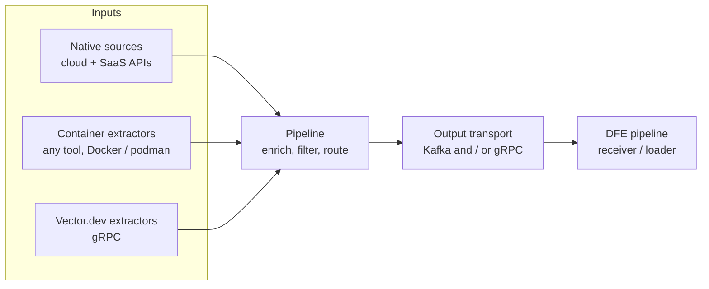

# dfe-fetcher

[](LICENSE)

Data fetcher for the HyperI DFE (Data Fusion Engine) platform. It pulls
security and operational data from cloud and SaaS providers, and from external
extractors, then delivers each record to the DFE pipeline over Kafka and/or
gRPC. It is built on the [scalo](https://github.com/hyperi-io/scalo-rs)
data-plane runtime (config cascade, logging, metrics, transport, tiered sink,
deployment contract).

## Architecture

Three input families feed a common pipeline. They are independent siblings, not
a chain: any combination can run at once.



See [docs/DESIGN.md](docs/DESIGN.md) for the full architecture, data flow, and
design rationale.

## Features

- **Native sources** -- poll provider APIs read-only on a schedule, authenticate
  per provider, paginate, and ship JSON. Per-provider admin setup lives in
  [docs/cloud-setup/](docs/cloud-setup/).
- **Container extractors** -- run any tool in a Docker or podman container and
  collect its stdout JSON lines, or accept HTTP POSTs to the ingest endpoint.
- **Vector.dev integration** -- receive data over Vector's native gRPC protocol.
- **Incremental fetch** -- per-source cursors persist the last fetch window
  between runs, so a restart resumes rather than refetches.
- **Enrichment and filtering** -- injects fetch and receive timestamps plus a
  source tag, then applies a per-source CEL filter that is hot-reloaded.
- **Tiered sink** -- in-memory buffering with a circuit breaker when the
  transport is unavailable.
- **Credential resolution** -- secrets manager, environment, or literal; OAuth2
  token management for providers that require it.
- **Observability** -- Prometheus metrics endpoint and liveness / readiness
  probes.
- **Live config reload** -- via SIGHUP or file watch.
- **Deployment artefacts** -- generates its own Dockerfile, Helm chart, and
  Compose file from a deployment contract.

## Quick Start

```bash
# Build
cargo build --release

# Validate a config without running
./target/release/dfe-fetcher config-check --config config.example.yaml

# Run
./target/release/dfe-fetcher --config config.example.yaml
```

Container and Helm artefacts are generated from the deployment contract:

```bash
dfe-fetcher emit-dockerfile > Dockerfile
dfe-fetcher emit-chart ./chart
dfe-fetcher emit-compose > docker-compose.yaml
```

## Configuration

[config.example.yaml](config.example.yaml) is the annotated reference for every
setting. Configuration loads through a layered cascade (CLI, then
`DFE_FETCHER_*` environment variables, then config files, then defaults); send
`SIGHUP` to reload the hot-reloadable settings without a restart. The cascade is
diagrammed in [docs/DESIGN.md](docs/DESIGN.md).

Default service ports: metrics and health on `9090` (`/livez`, `/readyz`,
`/metrics`), the ingest HTTP endpoint on `8080`, and the Vector gRPC
receiver on `6000`.

### Credential resolution

Credential fields accept three forms:

- `vault:secret/path:key` -- resolve from the secrets manager (OpenBao / Vault)
- `env:VARIABLE_NAME` -- read from an environment variable
- a literal value -- used as-is

## Sources

Each provider has an admin setup guide under
[docs/cloud-setup/](docs/cloud-setup/), indexed in
[docs/cloud-setup/README.md](docs/cloud-setup/README.md), which also explains
source maturity (alpha / beta / stable). A source declares its own maturity in
code, and the fetcher logs a warning at startup for any enabled source that is
not yet stable.

## Development

```bash
cargo fmt --check
cargo clippy -- -D warnings
cargo test
```

## License

BUSL-1.1 -- see [LICENSE](LICENSE) for details.

Copyright (c) 2026 HYPERI PTY LIMITED
