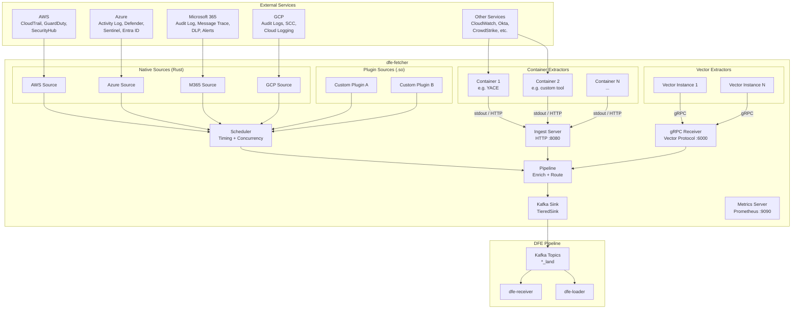
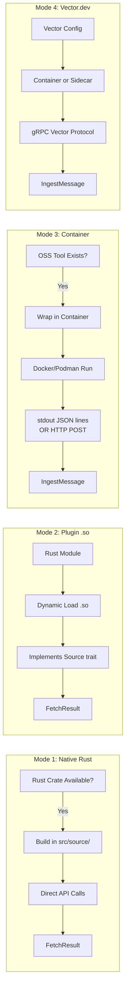
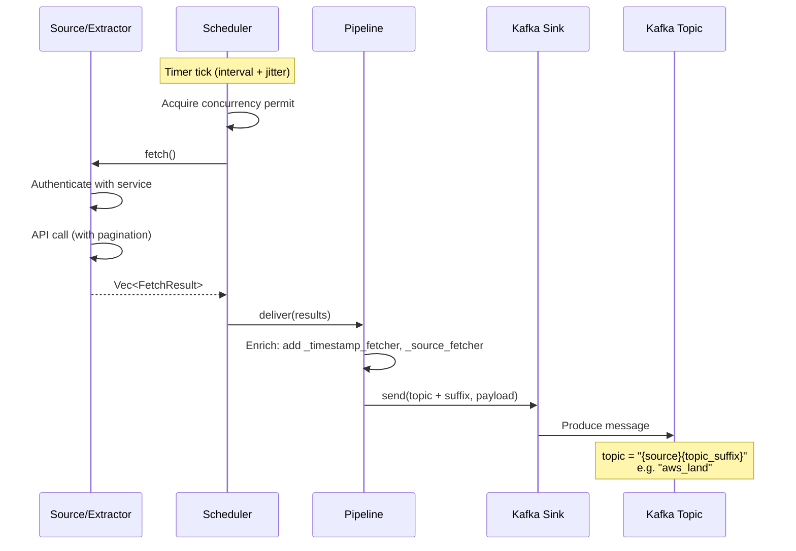
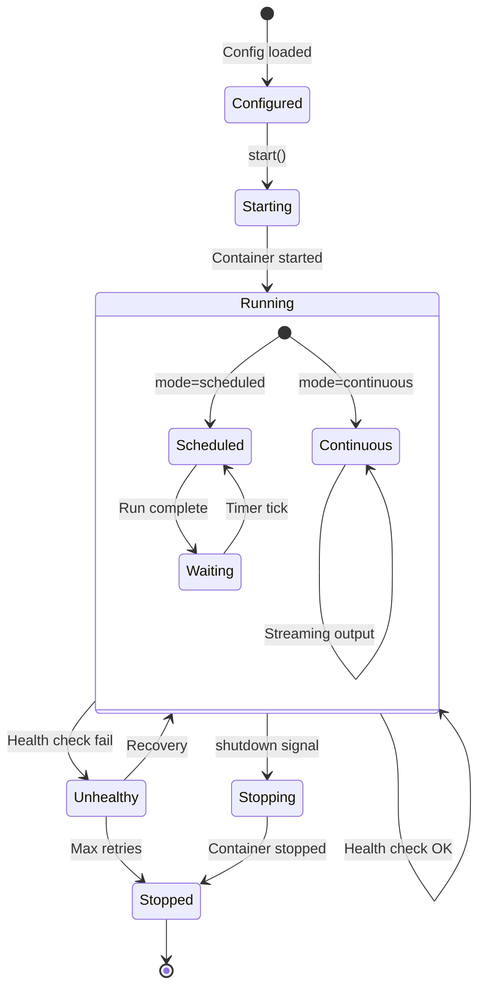
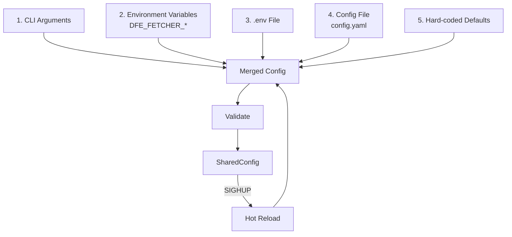
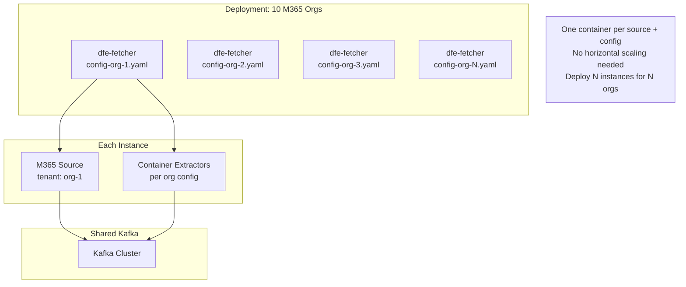
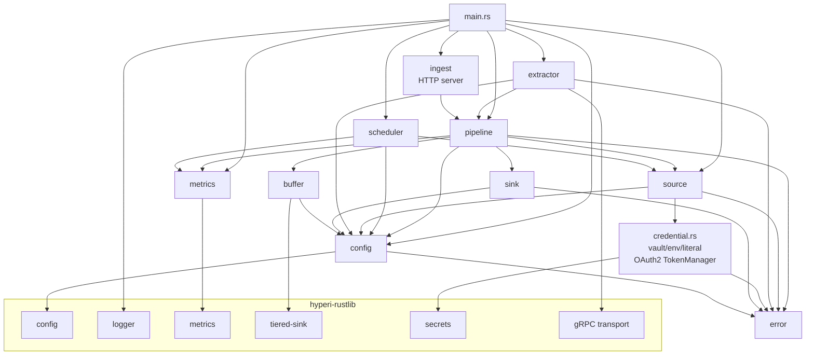

# dfe-fetcher Design Document

## Overview

dfe-fetcher is a data extraction service that pulls security and operational data from external cloud services and delivers it to the DFE pipeline via Kafka.

## High-Level Architecture

## Extraction Modes

## Data Flow

## Container Extractor Lifecycle

## Container Communication

```mermaid
graph TB
    subgraph "stdout Mode"
        C1[Container] -->|JSON lines on stdout| F1[Fetcher reads child stdout]
        F1 --> P1[Parse line as JSON]
        P1 --> D1[Deliver to Pipeline]
    end

    subgraph "HTTP Mode"
        C2[Container] -->|POST /ingest/source| F2[Ingest HTTP Server :8080]
        F2 --> P2[Parse JSON body]
        P2 --> D2[Deliver to Pipeline]
    end

    subgraph "gRPC Mode (Vector)"
        C3[Vector Container] -->|Vector gRPC protocol| F3[gRPC Server :6000]
        F3 --> P3[Convert to JSON]
        P3 --> D3[Deliver to Pipeline]
    end
```

## Configuration Cascade

## Multi-Tenant Deployment

## Module Dependencies

## Decision Framework: Native vs Container

| Criteria | Native (Rust) | Container |
|----------|--------------|-----------|
| Good Rust crate exists | Yes | - |
| Great OSS tool in another language | - | Yes |
| Need tight integration | Yes | - |
| Need isolation | - | Yes |
| Performance critical | Yes | - |
| Rapid prototyping | - | Yes |
| Third-party maintained | - | Yes |

### Examples

| Source | Mode | Reason |
|--------|------|--------|
| AWS CloudTrail | Native | `aws-sdk-cloudtrail` crate |
| Azure Activity Log | Native | REST API, `reqwest` sufficient |
| M365 Audit Log | Native | Graph API, `reqwest` sufficient |
| GCP Audit Logs | Native | `google-cloud-*` crates |
| CloudWatch Metrics | Container | YACE is mature Go project |
| Okta System Log | Container/Native | Evaluate Rust crate quality |
| CrowdStrike Falcon | Container | Vendor SDK typically Python |
| Syslog Collection | Vector | Vector has native syslog source |
