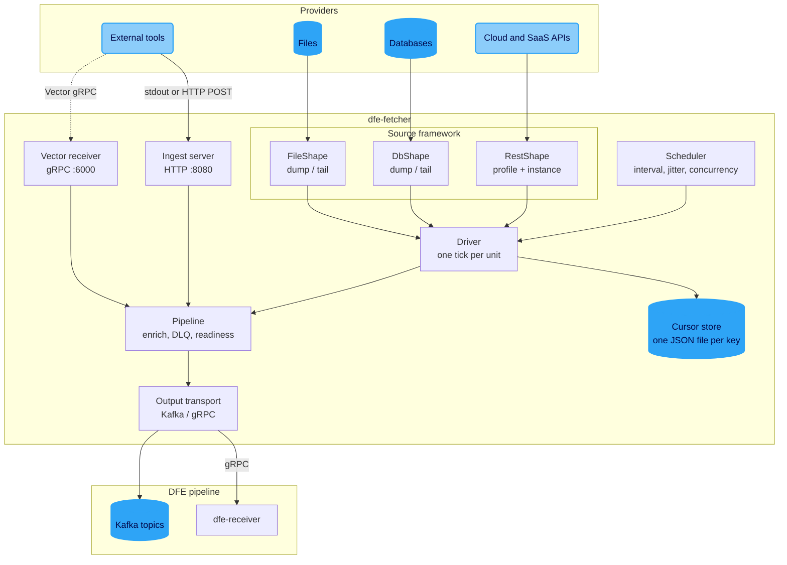
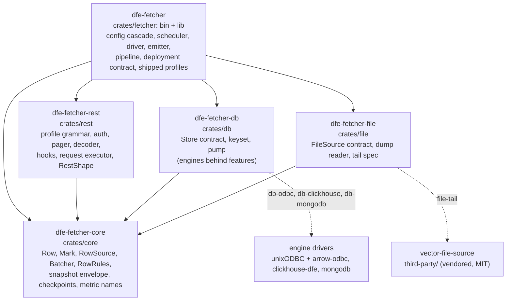
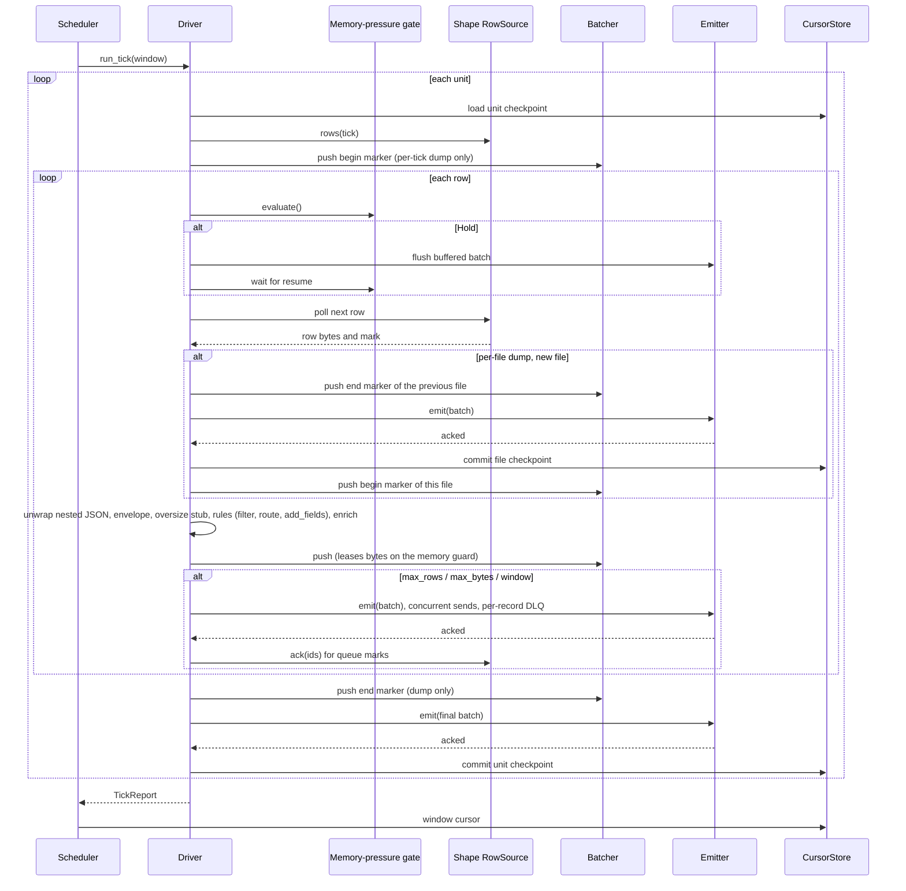
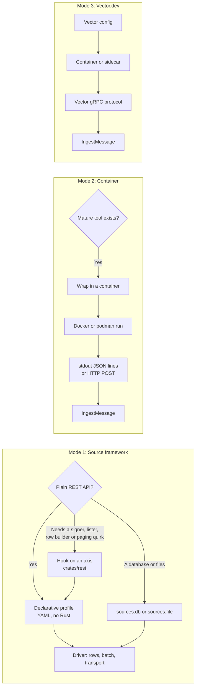
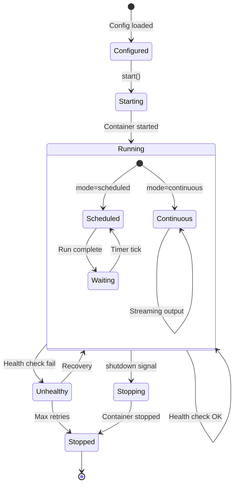
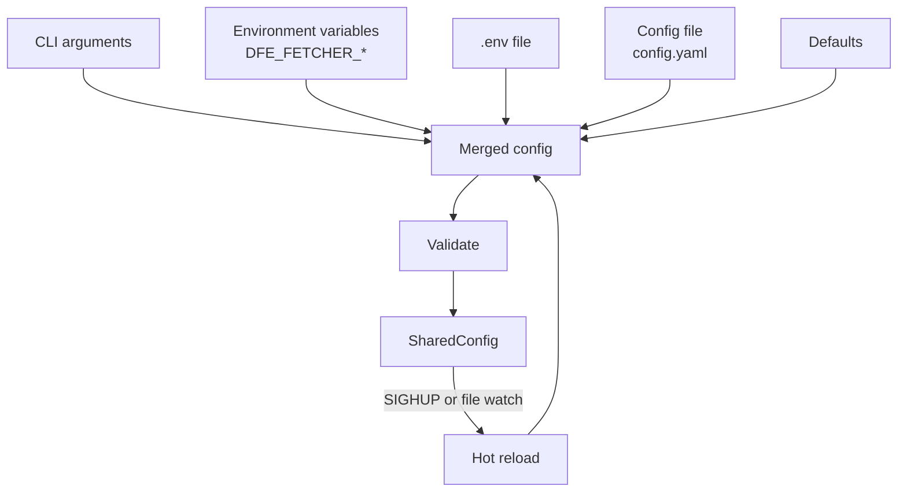
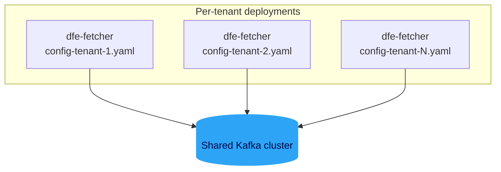

<!-- Project:   dfe-fetcher                          -->
<!-- File:      docs/DESIGN.md                        -->
<!-- Purpose:   Architecture, data flow, and design rationale -->
<!-- Language:  Markdown                               -->
<!--                                                   -->
<!-- License:   BUSL-1.1                               -->
<!-- Copyright: (c) 2026 HYPERI PTY LIMITED            -->

# dfe-fetcher Design Document

## Overview

dfe-fetcher pulls security and operational data from cloud and SaaS providers,
databases, files and external extractors, and delivers each record to the DFE
pipeline over Kafka and/or gRPC. Every provider is a declarative REST profile
run by one generic driver; databases and files are two more shapes on the same
driver. The codemap of the Cargo workspace is
[architecture.md](architecture.md); this document holds the diagrams and
the reasoning.

## High-Level Architecture

Blue cylinders are datastores, rounded faded nodes are external systems,
dotted edges are pushed events. The metrics server (Prometheus, `:9090`) and
the health probes are not drawn.

## Workspace Crates

The repo is a Cargo workspace laid out as a wide DAG off one I/O-free core, so
the shape crates compile in parallel and a profile change never rebuilds a
database driver. Solid edges are unconditional; dashed edges are the optional
engine drivers and the vendored tailer, each behind its feature.

The app links all four crates unconditionally, so a `sources.db` or
`sources.file` block is always understood and validated; what the features
decide is whether the ENGINE behind an accepted config is present, which is
why naming an engine this binary lacks is a load error rather than a parse
error.

## Source Framework: One Tick

Every framework source is a shape that yields rows lazily; the driver runs
each unit of a connection through one loop. A unit is one endpoint, store,
subscription or prefix; its rows are either events inside the scheduler's
window (incremental) or the whole store (a dump, wrapped in the snapshot
envelope). Rows are polled only while the memory-pressure gate admits them,
so not polling is what pushes back on the provider, and a held source flushes
what it has buffered before it waits.

The checkpoint is the part that makes a failure safe. Each row may carry a
mark (a queue ack id, a manifest item, a keyset tuple, a file offset); the
driver folds the marks of a batch and commits them only after the emitter
reports the batch acknowledged by the transport. A tick that fails commits
nothing more and re-fetches next time, and a queue message is acknowledged to
its broker only after it is on the wire.

A dump scoped per tick opens its snapshot before the first row, so an empty
store lands as an empty snapshot. A directory dump is scoped per file: a
snapshot opens at a file's first row and closes -- `end`, flush, checkpoint --
when the next file starts, so an idle tick publishes nothing and a bad file
leaves the files before it complete and committed.

### Emit

The emitter issues a flush's sends as concurrent futures (`accumulate.in_flight`
at a time). Every record gets a terminal outcome: sent, dead-lettered (a fatal
transport error, a truncated copy to the DLQ), or backpressured; the
backpressured subset is retried with a bounded backoff and, if still refused,
the whole tick aborts without a checkpoint so the scheduler's stall handling
takes over.

A dead letter counts only once the DLQ confirms a backend holds it (scalo's `Dlq::write_confirmed`: on disk for the file backend, acked by the broker for Kafka). A write the DLQ refuses or cannot confirm aborts the tick like a transport failure, so the checkpoint never passes a record nothing holds and the record is fetched again.

### Enrichment

Four names are reserved on every record: `_timestamp_fetcher`,
`_timestamp_received`, `_source` (the topic base) and `_source_fetcher`
(`<connection>.<unit>`). The per-source CEL filter runs on the provider's row
before they are added, so a filter cannot reference them. A payload that
already carries one keeps its own value under `<key>_original` and the
fetcher's value takes the name: the loader routes on `_source`, so the DFE
source name has to be the one that survives, and a record carrying the same
top-level key twice is rejected outright by ClickHouse rather than
dead-lettered.

`<key>_original` is never overwritten. A payload that already carries both the
reserved name and its `_original` -- a replayed record on a second enrich
pass, say -- keeps the `_original` it arrived with, and the colliding value is
parked under the next free `<key>_original_<n>` counting from 2, with a
warning naming the key.

## Cursor Cold Start

A tick with no window cursor to resume from -- none stored, a failed read, no store at all -- is a cold start. It logs a WARN and counts in `dfe_fetcher_cursor_cold_start_total{source}`, because an empty store cannot tell a new source from a lost cursor: a cursor directory with no volume behind it loses every cursor on a restart.

`cursor.on_missing_cursor` decides what the tick does. `lookback` (the default) fetches the last `default_window_hours`, so a new source starts on its own and a lost cursor skips anything older. `refuse` fetches nothing and fails the tick until a cursor exists, so a lost cursor never skips data and a new source never starts on its own.

## The Profile Grammar

A profile is the shape of an API and carries no identity: a base URL template,
the auth modes the API accepts, headers, the retry policy, where errors live in
a non-2xx body, the window format, and the endpoints with their decoder,
pager and construct. An instance is one deployment of that shape: its
credential kind and refs, `vars`, topic and interval, with per-unit narrowing.
Every struct rejects unknown keys and every enum is a closed vocabulary, so a
typo or an unsupported mode is a load error carrying the YAML line, never a
setting that parses and does nothing. The closed vocabulary (auth modes,
pagers, decoders, constructs, builders, listers), every field and the
validation rules are in
[reference/profile-grammar.md](reference/profile-grammar.md); the grammar as
built is `crates/rest/src/profile/mod.rs`.

## Database and File Shapes

A database instance (`sources.db.<id>`) names an engine, its connection
string as a secret spec, the block-cursor bounds and its stores. A `dump`
store selects the whole result set every tick into the snapshot envelope; a
`tail` store selects rows past the last committed key tuple in key order
(`WHERE key > $last ORDER BY key LIMIT n`) and each row carries its key as a
mark, committed after the batch is acknowledged. Engines are opt-in features
so a deployment links only the drivers it ships: `odbc` (unixODBC plus the
engine's own driver, with the SQL dialect named), `clickhouse` (the HTTP
interface, server-side JSON, typed placeholders for the tail) and `mongodb`
(the official driver: a collection dumped by `find`, tailed by change stream
from its resume token or by `_id`). The driver each engine needs, its
licence, whether the image ships it and what its tail commits are tabled in
[docs/reference/db-drivers.md](reference/db-drivers.md). Streaming is the
memory-safety rule, not an optimisation: an engine feeds rows in bounded
blocks, every buffered block is leased on the memory guard, and it stops
fetching when the driver stops polling.

A file instance (`sources.file.<id>`) names its units. A `dump` unit reads
each file its globs match once -- NDJSON, a JSON array or CSV, gzip detected by
magic -- lands each file as its own snapshot, and marks the file done with its
path and change time after its last row is acknowledged, so a file rewritten
in place is read again and a file dropped in by rename is never skipped. A
`tail` unit follows growing files through rotation and truncation on the
vendored Vector tailer and commits `(file fingerprint, end offset)` per line
after the acknowledgement; it needs the `file-tail` feature and is refused at
load without it.

| Shape | Unit kind | Checkpoint mark | Lands on |
|-------|-----------|-----------------|----------|
| REST profile, incremental | window of events | the scheduler's window cursor (a manifest unit also marks each item) | `<topic>` |
| REST profile, dump | the whole store per tick | none (nothing is incremental) | `<topic>-<unit>` |
| REST profile, queue | pulled messages | ack id per row | `<topic>` |
| DB dump | the whole result set per tick | none | `<topic>-<unit>` |
| DB tail | rows past the last key tuple | key tuple per row (the resume token on a MongoDB change stream) | `<topic>` |
| File dump | each matched file once | file path and change time per row | `<topic>-<unit>` |
| File tail | lines as files grow | fingerprint and end offset per line | `<topic>` |

The deployment's topic suffix (`_land` by default) is appended to every topic
in the table.

A database tail reads its store in pages of `limit` rows inside one tick, each
page resuming past the last row of the one before, and the tick ends on the
first short page or at `max_pages_per_tick`. One query per tick would cap a
unit at `limit / interval` rows a second whatever the table does, and a table
appending faster would fall behind with no signal; `tail_pages_full_total`
counts the pages that came back full, so a store repeatedly hitting the cap is
visible before it is a backlog.

## The Snapshot Envelope

A dump unit's rows travel in an envelope so a consumer can rebuild the whole
store by `snapshot_id` and tell a truncated dump from a complete one: one
`begin` frame, one `row` (or `oversize`) frame per record with a contiguous
`seq`, and one `end` frame carrying the row count, all stamped with the same
UUIDv7 `snapshot_id` and `snapshot_at` and all on the unit's own topic
(`<topic>-<unit>` plus the deployment suffix). A dump that aborts emits no
`end`, which is the consumer-side incompleteness signal. The frames, every
field, the per-tick and per-file scopes and the consumer rules are in
[reference/snapshot-envelope.md](reference/snapshot-envelope.md); the writer
and a reference reassembler are `crates/core/src/envelope.rs`.

## Extraction Modes

## Container Extractor Lifecycle

A continuous extractor that exits is restarted after an exponential backoff
capped by `max_restart_backoff_secs`; the backoff resets once a run has stayed
up for `stable_after_secs`.

## Container Communication

```mermaid
flowchart TB
    subgraph "stdout mode"
        C1[Container] -->|JSON lines on stdout| F1[Fetcher reads child stdout]
        F1 --> P1[Parse line as JSON]
        P1 --> D1[Deliver to pipeline]
    end

    subgraph "HTTP mode"
        C2[Container] -->|POST /ingest/source| F2[Ingest HTTP server :8080]
        F2 --> P2[Parse JSON body]
        P2 --> D2[Deliver to pipeline]
    end

    subgraph "gRPC mode - Vector"
        C3[Vector container] -->|Vector gRPC protocol| F3[gRPC server :6000]
        F3 --> P3[Convert to JSON]
        P3 --> D3[Deliver to pipeline]
    end
```

What each mode guarantees:

- Vector: the receiver is built armed, so with `extractors.vector.acknowledgements.enabled` (the default) a push is answered only after its events are emitted: `OK` once the outputs took them or the DLQ confirmed them, `UNAVAILABLE` otherwise, which Vector's sink retries. A push still unanswered near its hold budget (25 s, less when Vector sets a deadline) is answered `UNAVAILABLE` too, so a slow output can duplicate but not lose. Disabled, a push is answered once queued and a crash loses it. While the fetcher's memory-pressure latch holds, a push is refused `UNAVAILABLE` before any work.
- HTTP: `/ingest` answers `200` only after the outputs took the record or the DLQ confirmed it, and `503` with `Retry-After` otherwise.
- stdout: a pipe cannot be read twice, so a line the outputs refuse is dropped and counted in `dfe_fetcher_extractor_records_failed_total{extractor="container",outcome="dropped"}`, never in the received count.

At shutdown the extractors deliver what they hold before the outputs close, for up to 20 s: the Vector receiver refuses new pushes and delivers what it has queued, and a container extractor stops its container while still reading its stdout to the end. A scheduled container's `timeout_secs` bounds the whole run, stdout included: at the timeout the container is killed and the run fails.

A Vector push names no instance, so the listener it arrives on decides its topic. The shared `extractors.vector.grpc_bind_address`, the one port the chart publishes, carries at most one instance and lands on that instance's `topic`, or on `vector` when none shares it. Every other instance names its own `grpc_bind_address` and lands on its own `topic`. Two instances sharing the listener are refused at load.

## Configuration Cascade

Earlier layers win. Validation binds every profile instance (a shipped
profile by name or an inline one), every database instance and every file
instance, so a bad field fails the load with its path rather than the first
tick. The per-source filter, the routes, the scheduler interval and jitter are
hot-reloaded and read once per tick; `enabled`, credentials and topics need a
restart.

## Multi-Tenant Deployment

One fetcher per tenant, each with its own config, `instance_id` (the first half
of every cursor key) and credentials. Several accounts of one provider type
can share a fetcher: the typed blocks take a `connections` list, and
`sources.rest` takes any number of instances of one profile, each with its own
connection id.

## Decision Framework: Profile vs Container vs Vector

| Criterion | REST profile | Container | Vector |
|-----------|--------------|-----------|--------|
| A plain REST or JSON API | Yes | - | - |
| A mature tool in another language does the job | - | Yes | - |
| Vector already has a native source for it | - | - | Yes |
| Needs process isolation from the fetcher | - | Yes | - |
| Third-party maintained | - | Yes | Yes |
| Wanted: checkpoint after ack, the snapshot envelope, the memory brake | Yes | - | - |

### Examples

| Source | Mode | Reason |
|--------|------|--------|
| AWS CloudTrail | Profile | JSON API signed with the `sigv4` auth mode |
| Azure Activity Log | Profile | REST API paged by `nextLink` |
| M365 Audit Log | Profile | A prelude, a paged content list and a manifest per blob |
| runZero inventory | Profile | NDJSON exports as snapshot dumps |
| An inventory database | `sources.db` | A table dumped whole or tailed by key |
| Prometheus exporters | Container | A mature exporter run as a sidecar |
| Syslog collection | Vector | Vector has a native syslog source |

### Sidecar Patterns

For log sources that established tools handle well, use container extractors
with Filebeat, Fluentd, or similar collection agents:

| Source Type | Sidecar Tool | Communication |
|-------------|-------------|---------------|
| Syslog | Filebeat (system module) | HTTP POST to `/ingest/syslog` |
| Windows Event Logs | Filebeat (winlogbeat) | HTTP POST to `/ingest/windows_events` |
| Custom app logs | Filebeat (file input) | stdout JSON lines |
| Network captures | Zeek / Suricata | stdout JSON lines |
| Cloud provider logs | Cloud-specific CLI tools | stdout JSON lines |

Each sidecar runs as a container extractor with `mode: continuous` and
communicates via stdout (JSON lines) or HTTP POST to the ingest endpoint.
The fetcher manages the container lifecycle including restart-on-crash with
exponential backoff. A log file the fetcher itself can reach is a
`sources.file` tail unit instead.

## Performance Sensitivity

> **dfe-fetcher is less hot-path-sensitive than the rest of the DFE stack.**

Typical fetcher volumes are orders of magnitude lower than the loader /
receiver / transform / archiver tier. A single fetcher pod servicing one
tenant's combined AWS / Azure / M365 / GCP / SaaS audit feeds normally
moves tens to a few thousand records per minute. The downstream pipeline
moves PB/hour. The fetcher is also I/O-bound waiting on remote cloud
APIs, not CPU-bound parsing or routing.

What this means in practice:

| Concern | Rest of DFE stack | dfe-fetcher |
|---|---|---|
| Per-record allocation | Zero-allocation hot path; pre-allocated pools, arenas | Allocate freely - `Vec`, `String`, `serde_json::Value` are fine |
| SIMD JSON parse | `sonic-rs` mandatory on hot paths | `serde_json` is sufficient |
| Cloning / `Bytes` reuse | Aggressive `Bytes` reuse, `Cow`, arena lifetimes | One allocation per enveloped row is fine |
| Channel sizing | Backpressure-tuned bounded channels per stage | The batcher's bounds and the memory guard's lease are the backpressure |
| `regex` on hot path | Forbidden - use `memchr` / `memmem::Finder` | Acceptable if needed; volumes don't justify rewrite |
| `async fn` granularity | Watch `.await` budget, yield_now hints | `await` per HTTP request is the unit of work; one virtual `poll_next` per row through a boxed stream |
| Per-source concurrency | Lock-free, sharded, ArcSwap | A mutex around a token cache is acceptable |

We still care about correctness, cancellation safety, bounded retries,
and not leaking tasks - those are correctness concerns, not perf
concerns. We also still prefer the simple, idiomatic version of any
pattern over the clever one. But the aggressive hot-path discipline
documented in the hyperi-ai Rust standards and applied across
dfe-loader / dfe-receiver / dfe-archiver does **not** need to be
applied symmetrically here.

This trade-off is deliberate. It keeps a source a YAML profile rather than
Rust, keeps the driver one readable loop, and reserves the harder
optimisation work for the pipeline tiers where volumes actually demand it.
The two shortcuts the driver takes on purpose -- fetch and emit do not
overlap, and the row stream is boxed -- are marked where they sit in
`crates/fetcher/src/driver.rs` with the measurement that would lift them.
When a fetcher source ever becomes a bottleneck (sustained high-cardinality
tenants, very chatty audit feeds), revisit on a case-by-case basis - the
scalo hot-path patterns are available if needed, just not the default
starting point here.
