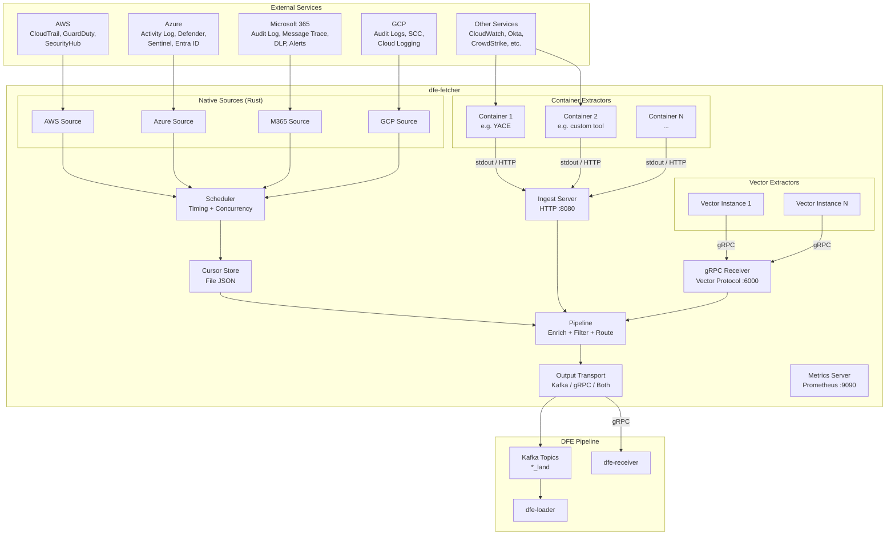
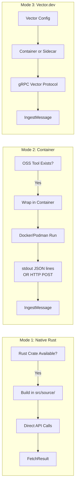
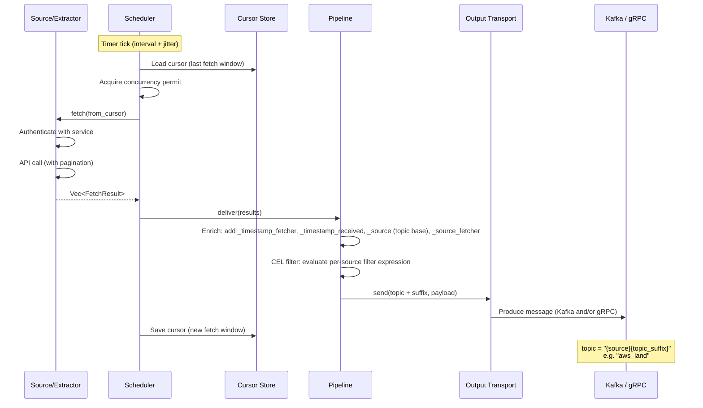
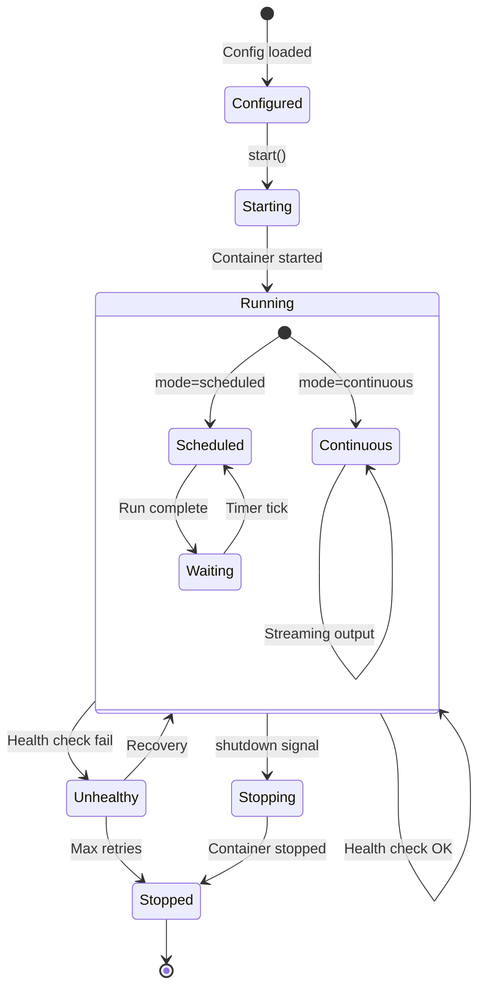
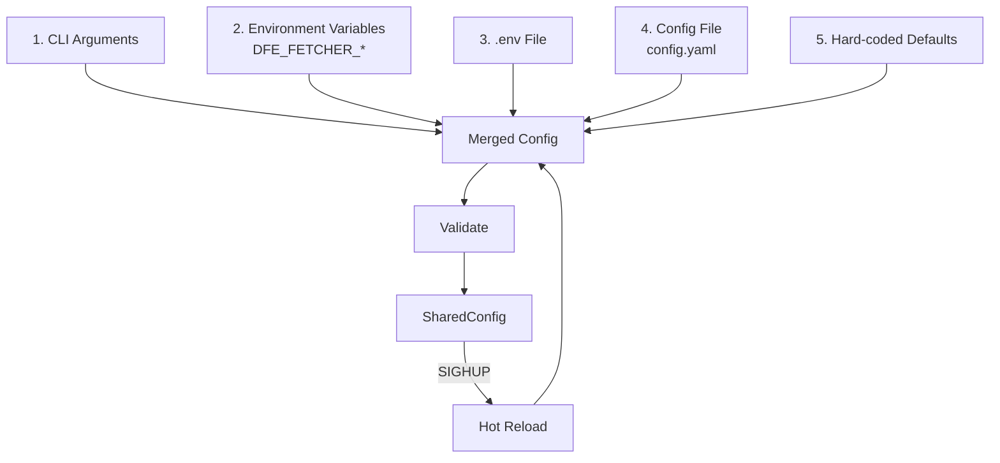
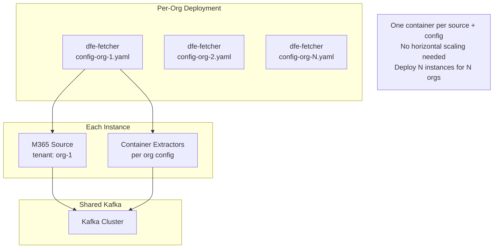
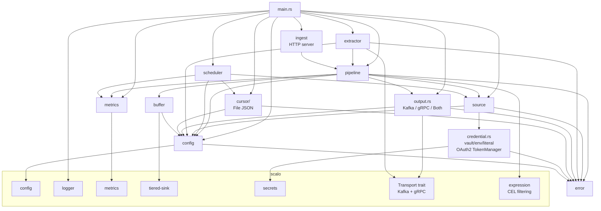

<!-- Project:   dfe-fetcher                          -->
<!-- File:      docs/DESIGN.md                        -->
<!-- Purpose:   Architecture, data flow, and design rationale -->
<!-- Language:  Markdown                               -->
<!--                                                   -->
<!-- License:   BUSL-1.1                               -->
<!-- Copyright: (c) 2026 HYPERI PTY LIMITED            -->

# dfe-fetcher Design Document

## Overview

dfe-fetcher is a data extraction service that pulls security and operational data from external cloud services and delivers it to the DFE pipeline via Kafka.

## High-Level Architecture

## Extraction Modes

## Data Flow

Those four enrichment names are reserved. A payload that already carries one
keeps its own value under `<key>_original` and the fetcher's value takes the
name: the loader routes on `_source`, so the DFE source name has to be the one
that survives, and a record carrying the same top-level key twice is rejected
outright by ClickHouse rather than dead-lettered.

`<key>_original` is never overwritten. A payload that already carries both the
reserved name and its `_original` -- a replayed record on a second enrich pass,
say -- keeps the `_original` it arrived with, and the colliding value is parked
under the next free `<key>_original_<n>` counting from 2, with a warning naming
the key.

## Container Extractor Lifecycle

## Container Communication

```mermaid
graph TB
    subgraph "stdout Mode"
        C1[Container] -->|JSON lines on stdout| F1[Fetcher reads child stdout]
        F1 --> P1[Parse line as JSON]
        P1 --> D1[Deliver to Pipeline]
    end

    subgraph "HTTP Mode"
        C2[Container] -->|POST /ingest/source| F2[Ingest HTTP Server :8080]
        F2 --> P2[Parse JSON body]
        P2 --> D2[Deliver to Pipeline]
    end

    subgraph "gRPC Mode (Vector)"
        C3[Vector Container] -->|Vector gRPC protocol| F3[gRPC Server :6000]
        F3 --> P3[Convert to JSON]
        P3 --> D3[Deliver to Pipeline]
    end
```

## Configuration Cascade

## Multi-Tenant Deployment

## Module Dependencies

## Decision Framework: Native vs Container

| Criteria | Native (Rust) | Container |
|----------|--------------|-----------|
| Good Rust crate exists | Yes | - |
| Great OSS tool in another language | - | Yes |
| Need tight integration | Yes | - |
| Need isolation | - | Yes |
| Performance critical | Yes | - |
| Rapid prototyping | - | Yes |
| Third-party maintained | - | Yes |

### Examples

| Source | Mode | Reason |
|--------|------|--------|
| AWS CloudTrail | Native | Direct REST, signed with `reqsign` (SigV4) |
| Azure Activity Log | Native | REST API, `reqwest` sufficient |
| M365 Audit Log | Native | Microsoft Graph REST, OAuth2 |
| GCP Audit Logs | Native | Direct REST, service-account JWT |
| Prometheus exporters | Container | Mature exporter (e.g. a Go tool) run as a sidecar |
| Syslog collection | Vector | Vector has a native syslog source |

### Sidecar Patterns

For log sources that established tools handle well, use container extractors
with Filebeat, Fluentd, or similar collection agents:

| Source Type | Sidecar Tool | Communication |
|-------------|-------------|---------------|
| Syslog | Filebeat (system module) | HTTP POST to `/ingest/syslog` |
| Windows Event Logs | Filebeat (winlogbeat) | HTTP POST to `/ingest/windows_events` |
| Custom app logs | Filebeat (file input) | stdout JSON lines |
| Network captures | Zeek / Suricata | stdout JSON lines |
| Cloud provider logs | Cloud-specific CLI tools | stdout JSON lines |

Each sidecar runs as a container extractor with `mode: continuous` and
communicates via stdout (JSON lines) or HTTP POST to the ingest endpoint.
The fetcher manages the container lifecycle including restart-on-crash with
exponential backoff.

## Performance Sensitivity

> **dfe-fetcher is less hot-path-sensitive than the rest of the DFE stack.**

Typical fetcher volumes are orders of magnitude lower than the loader /
receiver / transform / archiver tier. A single fetcher pod servicing one
tenant's combined AWS / Azure / M365 / GCP / SaaS audit feeds normally
moves tens to a few thousand records per minute. The downstream pipeline
moves PB/hour. The fetcher is also I/O-bound waiting on remote cloud
APIs, not CPU-bound parsing or routing.

What this means in practice:

| Concern | Rest of DFE stack | dfe-fetcher |
|---|---|---|
| Per-record allocation | Zero-allocation hot path; pre-allocated pools, arenas | Allocate freely - `Vec`, `String`, `serde_json::Value` are fine |
| SIMD JSON parse | `sonic-rs` mandatory on hot paths | `serde_json` is sufficient |
| Cloning / `Bytes` reuse | Aggressive `Bytes` reuse, `Cow`, arena lifetimes | `Bytes::from(serde_json::to_vec(&doc)?)` per record is fine |
| Channel sizing | Backpressure-tuned bounded channels per stage | Default Tokio channels; per-source `for` loops are fine |
| `regex` on hot path | Forbidden - use `memchr` / `memmem::Finder` | Acceptable if needed; volumes don't justify rewrite |
| `async fn` granularity | Watch `.await` budget, yield_now hints | `await` per HTTP request is the unit of work |
| Per-source concurrency | Lock-free, sharded, ArcSwap | `Arc<Mutex<>>` for an OAuth token cache is acceptable |

We still care about correctness, cancellation safety, bounded retries,
and not leaking tasks - those are correctness concerns, not perf
concerns. We also still prefer the simple, idiomatic version of any
pattern over the clever one. But the aggressive hot-path discipline
documented in the hyperi-ai Rust standards and applied across
dfe-loader / dfe-receiver / dfe-archiver does **not** need to be
applied symmetrically here.

This trade-off is deliberate. It keeps the per-source code
straightforward (one async function per HTTP endpoint, `Vec` of
records out), keeps the cognitive load low for new sources, and
reserves the harder optimisation work for the pipeline tiers where
volumes actually demand it. When a fetcher source ever becomes a
bottleneck (sustained high-cardinality tenants, very chatty audit
feeds), revisit on a case-by-case basis - the scalo hot-path
patterns are available if needed, just not the default starting
point here.
